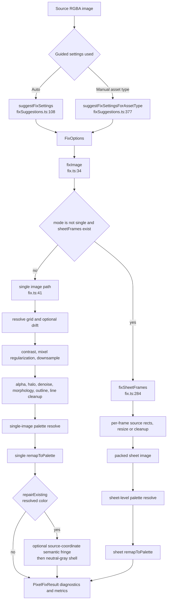

# PixelAid image-fixing process docs

This directory documents how PixelAid composes its image-fixing pipeline today. It is intentionally about orchestration: which functions run, in what order, and which options decide between branches. Algorithm internals live in the source files and in the older algorithm notes; these files cite concrete code anchors so each statement can be checked against implementation.

The composition root is `packages/core/src/fix.ts:34 fixImage()`. It dispatches frame-aware sheet work before the single-image path, then both paths converge on cleanup, palette resolution, palette remapping, and `PixelFixResult` assembly. Single-image `repairExisting` can run repair-only post-palette source-coordinate semantic fringe and neutral-gray shell passes between remap and assembly; the sheet-frame path does not. Guided settings come from `packages/core/src/fixSuggestions.ts:108 suggestFixSettings()` and `packages/core/src/fixSuggestions.ts:377 suggestFixSettingsForAssetType()`; surfaces such as the worker, web app, and CLI pass those options into `fixImage()` rather than running a separate engine.

## Documentation map

- [Single sprite and icon path](single-sprite.md) — the non-frame path through `fixImage()` for `options.mode === "single"` and for any non-single mode that lacks `sheetFrames`.
- [Sprite sheet path](sprite-sheet.md) — the frame-aware branch selected by `isSheetFrameFix()` and implemented by `fixSheetFrames()`.
- [Tileset and tilemap path](tileset.md) — `tileSheet` defaults, diagnostics, seam repair, tilemap metadata extraction, and how they compose with the sheet-frame path.
- [Background path](background.md) — preservation-oriented background and portrait-style behavior, including what cleanup is skipped by defaults.

## Shared skeleton

Notes on the skeleton:

- `fixImage()` dispatches only when `options.mode !== "single"` **and** `options.sheetFrames` is present and non-empty (`fix.ts:280 isSheetFrameFix()`). A `spriteSheet` or `tileSheet` option without frames falls through to the non-frame path.
- The single-image path resolves a grid, preprocesses, downsamples, cleans, resolves a palette, remaps, may run `repairExisting`-only post-palette fringe/shell repairs, then assembles result diagnostics (`fix.ts:41-265`).
- The sheet-frame path preprocesses the whole sheet once, fixes each frame into a packed output, then resolves and remaps one sheet-level palette (`fix.ts:290-401`).

## Asset type to mode map

`packages/shared/src/assetTypes.ts:13 assetTypeDefinitions` is the authoritative mode table used by `assetTypeToMode()` at `assetTypes.ts:149`.

| Asset type | Mode | Support | Covered by |
| --- | --- | --- | --- |
| `sprite` | `single` | full | `single-sprite.md` |
| `icon` | `single` | full | `single-sprite.md` |
| `portrait` | `single` | inspectOnly | `background.md` |
| `uiElement` | `single` | inspectOnly | `background.md` for preservation-style behavior |
| `background` | `single` | inspectOnly | `background.md` |
| `spriteSheet` | `spriteSheet` | full | `sprite-sheet.md` |
| `animationSheet` | `spriteSheet` | full | `sprite-sheet.md` |
| `characterSheet` | `spriteSheet` | full | `sprite-sheet.md` |
| `iconSet` | `spriteSheet` | full | `sprite-sheet.md` |
| `tileset` | `tileSheet` | full | `tileset.md` |
| `tilemap` | `tileSheet` | full | `tileset.md` |

## Entry points that feed this pipeline

| Surface | What it calls | Code anchors |
| --- | --- | --- |
| Worker auto-suggest | `suggestFixSettings()` or `suggestFixSettingsForAssetType()` | `packages/worker/src/pipeline.ts:104 runSuggestFixRequest()` |
| Worker fix | `fixImage()` with progress and optional cached grid candidates | `packages/worker/src/pipeline.ts:113 runFixImageRequest()` |
| Web app fix | Builds `FixOptions`, includes `sheet` and `sheetFrames` when sheet mode is active, then starts a worker job | `apps/web/src/App.tsx:4260-4307`, `apps/web/src/App.tsx:4397-4403` |
| CLI single fix | `fixSprite()` normalizes or auto-suggests options, then calls `fixImage()` | `packages/automation/src/operations.ts:382 fixSprite()`, `operations.ts:1063 runFix()` |
| CLI sheet fix | `fixSpriteSheet()` detects or receives frames, creates sheet options, then calls `fixImage()` | `packages/automation/src/operations.ts:487 fixSpriteSheet()`, `operations.ts:514-537` |

## Shared stage walkthrough

| Stage | Single-image branch | Sheet-frame branch | Code anchors |
| --- | --- | --- | --- |
| Dispatch | Continues when `isSheetFrameFix()` is false. | Runs when mode is non-single and `sheetFrames.length > 0`. | `fix.ts:34-39`, `fix.ts:280-284` |
| Grid or frame geometry | Resolves one grid candidate from auto/manual settings. | Uses `sheetFrames`, `sheet`, and grid scale/phase to map destination frames to source rects. | `fix.ts:48`, `fix.ts:1677-1736`, `fix.ts:311`, `fix.ts:1289-1322` |
| Source conditioning | Optional background pre-alpha, local drift, contrast expansion, mixel regularization. | Whole-sheet contrast expansion, then per-frame resize/copy/native-scale cleanup. | `fix.ts:41-87`, `fix.ts:303-323`, `fix.ts:414-508` |
| Downsample | `snapToGrid()` or `downsampleBlocks()`. | `downsampleBlocks()` only when a source frame and output frame differ in size; inferred-native frames use dominant native downsample. | `fix.ts:90-127`, `fix.ts:427-452`, `fix.ts:480-499` |
| Alpha and cleanup | Runs alpha, optional outline padding, halo, denoise, morphology, outline, line cleanup in one image sequence. | Runs alpha, halo, denoise, morphology, outline, line cleanup inside `cleanFixedImage()` per frame. | `fix.ts:131-163`, `fix.ts:1151-1190` |
| Palette and post-palette | Resolves palette from the cleaned single image, remaps, then may run `repairExisting`-only source-coordinate semantic fringe replacement and neutral-gray shell normalization before result assembly. | Resolves one sheet palette from the packed sheet, remaps, then may run the existing sheet-safe post-palette semantic fringe cleanup; it does not run the source-coordinate or neutral-gray shell repairs. | `fix.ts:168-224`, `fix.ts:380-407`, `palette.ts:124-201` |
| Result | Adds grid, metrics, settings, and diagnostics. | Adds packed sheet image, synthetic sheet grid, metrics, settings, and diagnostics. | `fix.ts:230-265`, `fix.ts:424-451` |

## Diagnostics and metadata

All branches return `PixelFixResult` from `packages/shared/src/types.ts:625`: image, palette, grid, metrics, settings, and optional diagnostics. Pipeline stages contribute diagnostics only when their pass ran or was relevant:

- `alpha`, `halo`, `morphology`, `outline`, `lineCleanup`, `palette`, `contrastExpansion`, `mixels`, `tilesetRepairs`, and `phaseTimings` are defined in `PixelFixDiagnostics` at `types.ts:367`.
- Single-image diagnostics are assembled at `fix.ts:250-260`. This path can include detailed halo, outline, and line-cleanup diagnostics because it calls the detailed helpers directly.
- Sheet-frame diagnostics are assembled at `fix.ts:440-447`. This path merges alpha, morphology, and semantic-fringe diagnostics across frames and includes the sheet palette, but it does not currently return per-frame halo, outline, or line-cleanup detail.
- Tileset seam repair is not part of `fixImage()`; the web app can add `diagnostics.tilesetRepairs` after calling `applyTilesetSeamRepairs()` (`apps/web/src/App.tsx:4543-4571`).
- Scene and tilemap diagnostics used by inspection/preview are side analyses, not automatic `PixelFixResult.diagnostics` fields (`packages/core/src/sceneDiagnostics.ts:15`, `packages/core/src/tilemapDiagnostics.ts:18`).

## Where the knobs live

| Knob group | Primary fields | What they affect |
| --- | --- | --- |
| Asset identity | `assetType`, `mode` | Suggestion presets and dispatch mode. `assetTypeToMode()` maps type to mode (`assetTypes.ts:149`). |
| Target geometry | `targetWidth`, `targetHeight`, `grid.*`, `sheet`, `sheetFrames` | Single grid resolution or sheet frame packing and source-rect mapping. |
| Downscale | `downscale`, `cleanup.dominantThreshold`, `grid.snap`, `grid.localCorrection`, `grid.fixMixels` | Block sampler choice, adaptive coverage, snap path, local drift boundaries, and mixel pre-regularization. |
| Transparency | `alpha`, `alphaSettings` | Optional pre-alpha, post-downsample alpha, color-key/flood-fill/binary/preserve behavior, and transparent RGB cleanup. |
| Cleanup | `cleanup.removeHalos`, `denoiseStrength`, `morphology`, `outline*`, `semanticFringeColors`, `lineCleanup`, `removeOrphans`, `jaggyCleanup`, `preserveSinglePixelDetails` | Edge, matte, outline, semantic fringe, denoise, line, morphology, and `repairExisting`-only post-palette shell/fringe passes. |
| Palette | `palette`, `paletteSettings`, `maxColors` | Fixed/preset/auto palette resolution, lock scope, dithering, color space, protected colors, and final remap. |
| Sheet/tile extras | `sheet.frameWidth`, `frameHeight`, `rows`, `columns`, `margin`, `spacing`, tilemap identity threshold in callers | Frame slicing, tileset seam diagnostics, seam repair, and tilemap metadata extraction. |

## Reading order

Read `single-sprite.md` first if you need the most detailed pass-by-pass composition. Then read `sprite-sheet.md` to see which passes move inside the frame loop and which stay sheet-level. `tileset.md` and `background.md` explain asset-specific defaults and side workflows layered around those two core paths.
