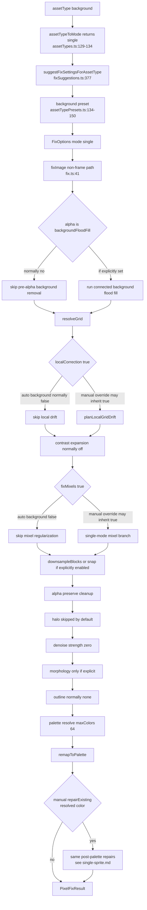

# Background and preservation-style image pipeline

Backgrounds are mapped to `single` mode but use preservation-oriented defaults. The same non-frame branch in `fixImage()` runs, yet guided settings avoid the sprite-specific destructive passes: no flood-fill background removal, no default halo cleanup, no default denoise, no orphan removal, no jaggy cleanup, larger palette budget, and palette preservation warnings. The relevant defaults are in `packages/shared/src/assetTypePresets.ts:134-150` and the manual override logic is in `packages/core/src/fixSuggestions.ts:377 suggestFixSettingsForAssetType()`.

This page also applies to portrait and UI-element style sources where the intent is to preserve gradients, scene detail, and soft alpha. Those asset types differ in exact presets, but they share the idea that the fixer is the single-image path with conservative options, not a separate scene renderer.

## Main flow

## Background defaults

| Setting | Default source | Background behavior |
| --- | --- | --- |
| Mode | `assetTypes.ts:129-134` | `background` uses `processingMode: "single"` and is marked `inspectOnly`. |
| Max colors | `assetTypePresets.ts:137-139` | `maxColors: 64`, larger than sprite and sheet presets. |
| Downscale | `assetTypePresets.ts:139` | `adaptive`. |
| Alpha | `assetTypePresets.ts:140-142` | `preserve` with soft-alpha preservation settings and `decontaminateRgb: false`. |
| Orphan and jaggy cleanup | `assetTypePresets.ts:143-145` | Disabled by default. |
| Halo removal | `assetTypePresets.ts:146` | Disabled for backgrounds. Portrait/UI presets can enable halos, but background does not. |
| Denoise | `assetTypePresets.ts:147` | `0`, so denoise pass runs as a no-op configuration. |
| Palette lock | `assetTypePresets.ts:148` | Not locked across frames because background is single mode. |
| Warnings | `assetTypes.ts:135-140`, `assetTypePresets.ts:149` | Background is inspect-only and warns to preserve intentional detail. |

`analyzeSceneAssetDiagnostics()` is used by inspection and the web app to explain preservation risk. It samples coarse RGB bins and local luma deltas, reports detail density, palette risk, and background-preservation warnings (`packages/core/src/sceneDiagnostics.ts:15-63`, `sceneDiagnostics.ts:96-138`). It does not alter pixels.

## Stage-by-stage behavior

| Order | Stage | Code anchors | Background-specific notes |
| --- | --- | --- | --- |
| 1 | Suggestion and override | `fixSuggestions.ts:377-472` | Manual background override starts from a generic suggestion but replaces asset type, mode, max colors, palette strategy, alpha, alpha settings, cleanup values, and warnings. |
| 2 | Alpha selection | `fixSuggestions.ts:422-430`, `assetTypePresets.ts:140-142` | For background, alpha comes from the preset: `preserve`. `suggestAlphaMode()` only auto-selects `backgroundFloodFill` for `sprite` or `icon` (`fixSuggestions.ts:1842-1882`). |
| 3 | Pre-alpha | `fix.ts:41-45` | Skipped by default because `alpha !== "backgroundFloodFill"`. If a user explicitly sets flood fill, the same connected border-fill pre-alpha as sprites runs. |
| 4 | Grid resolution | `fix.ts:48`, `fix.ts:1677-1736` | The single path still resolves a grid. In raw `fixImage()`, `cropToBounds` defaults true for single mode if unset (`fix.ts:1693`). Some surfaces may pass an explicit value; automation's core suggestion conversion sets `cropToBounds: false` (`packages/automation/src/operations.ts:956-963`). |
| 5 | Local drift | `fix.ts:49-52`, `fixSuggestions.ts:314-319` | Auto-classified backgrounds set `localCorrection` false because the condition excludes `assetType === "background"`. Manual background override does not explicitly clear inherited `localCorrection`, so a user/surface can still pass true. |
| 6 | Contrast expansion | `fix.ts:61-63`, `fixSuggestions.ts:661-677` | Background cleanup eligibility disables outline repair and palette-limit cleanup in many cases, so guided background suggestions generally leave contrast expansion off (`fixSuggestions.ts:462`, `fixSuggestions.ts:700-789`). Explicit settings can still enable it. |
| 7 | Mixel regularization | `fix.ts:67-87`, `fixSuggestions.ts:355-374`, `fixSuggestions.ts:459-461` | Auto-classified backgrounds get `fixMixels: false` because `recommendFixMixels()` rejects background assets. Manual background override preserves `suggestion.fixMixels` for single mode, so inherited or explicit settings can still run the mixel branch. |
| 8 | Downsample or snap | `fix.ts:88-127` | Uses the same `snapToGrid()` or `downsampleBlocks()` choice as other single images. Defaults favor `adaptive` from the preset. |
| 9 | Post-alpha | `fix.ts:131-139`, `alpha.ts:10-35` | Default `preserve` clones the image and collects alpha diagnostics without decontaminating RGB because preset `decontaminateRgb` is false (`alpha.ts:16-24`, `assetTypePresets.ts:33-38`). |
| 10 | Halo and denoise | `fix.ts:142-144` | Halo removal is disabled by default and omitted from diagnostics unless explicitly enabled. Denoise strength is 0 for backgrounds. |
| 11 | Morphology and decontamination | `fix.ts:145-146`, `fix.ts:1130-1149` | No morphology is included by the background preset. If a user enables matte morphology, deferred decontamination only applies when alpha is not `preserve` and decontamination is requested. |
| 12 | Outline and line cleanup | `fix.ts:147-163`, `fixSuggestions.ts:679-698` | Guided background override sets outline to `none` unless cleanup eligibility allows outline repair; preservation assets usually fail cleanup eligibility (`fixSuggestions.ts:700-789`). Line cleanup runs only when explicitly configured. |
| 13 | Palette and optional repair post-palette | `fix.ts:166-224`, `palette.ts:124-201` | Backgrounds default to `maxColors: 64`, `medianCut`, and `outlineMode: "none"`, so the guided default stops after remap. If a manual single-mode background is explicitly set to `repairExisting` and resolves an outline color, it follows the same post-palette source-coordinate semantic fringe and neutral-gray shell order documented in `single-sprite.md`. |
| 14 | Result | `fix.ts:230-265` | Same `PixelFixResult` shape as sprites, with diagnostics reflecting which conservative passes actually ran. |

## Branches skipped by default

| Branch | Why skipped for guided background defaults | Code anchors |
| --- | --- | --- |
| Background flood-fill removal | `suggestAlphaMode()` only selects it for sprites/icons; background preset alpha is `preserve`. | `fixSuggestions.ts:1842-1882`, `assetTypePresets.ts:140-142` |
| Local drift planning | Auto suggestion excludes background assets. | `fixSuggestions.ts:314-319` |
| Mixel repair | `recommendFixMixels()` returns false for `assetType === "background"`. | `fixSuggestions.ts:355-374` |
| Halo removal | Background preset sets `removeHalos: false`. | `assetTypePresets.ts:146`, `fix.ts:142` |
| Denoise | Background preset sets `denoiseStrength: 0`. | `assetTypePresets.ts:147`, `fix.ts:144` |
| Morphology matte cleanup | Background preset supplies no morphology settings; cleanup eligibility marks preservation assets conservatively. | `assetTypePresets.ts:134-150`, `fixSuggestions.ts:700-789` |
| Outline repair | Cleanup eligibility disables most cleanup for `background` and `tilemap` as preservation-style assets. | `fixSuggestions.ts:712-714`, `fixSuggestions.ts:746-768` |
| Orphan and jaggy cleanup | Background preset disables both. | `assetTypePresets.ts:143-145` |

## Crop behavior nuance

There are two layers to crop behavior:

1. In core `fixImage()`, if `grid.cropToBounds` is omitted and mode is `single`, target-guided auto grid may crop to the detected source bounds (`fix.ts:1693-1712`). Outline padding uses the same single-mode default (`fix.ts:1398-1403`).
2. Surfaces can pass explicit `cropToBounds`. Automation's conversion from core suggestion sets `grid.cropToBounds: false` (`packages/automation/src/operations.ts:956-963`). The web app builds options from UI state and passes `cropToBounds` in its grid object (`apps/web/src/App.tsx:4260-4264`).

So "background" does not have its own crop branch. It either uses the core single-mode default or the explicit value provided by the caller.

## Palette and scene diagnostics

Backgrounds are where scene-level analysis matters most, but it is separate from pixel fixing:

- `suggestFixSettings()` classifies large landscape single-image proportions as `background` (`fixSuggestions.ts:1046-1051`).
- `suggestCleanupEligibility()` disables palette-limit eligibility for backgrounds and marks preservation reasons (`fixSuggestions.ts:776-780`). The actual palette still resolves and remaps in `fixImage()` because every output gets a palette; the difference is budget and warnings, not a skipped palette stage.
- `analyzeSceneAssetDiagnostics()` returns `colorBinCount`, `detailDensity`, `paletteRiskScore`, and warnings like `background-preserve-detail`, `scene-palette-density`, and `scene-detail-density` (`sceneDiagnostics.ts:55-63`, `sceneDiagnostics.ts:96-138`).
- Web preview computes scene diagnostics for `background` and `tilemap` assets (`apps/web/src/App.tsx:2581-2586`). Automation inspection does the same (`packages/automation/src/operations.ts:236-243`).

## Diagnostics and metadata

The background path uses the same diagnostics assembly as the single path (`fix.ts:210-220`):

| Diagnostic key | Expected with defaults | Notes |
| --- | --- | --- |
| `alpha` | Yes | Mode is `preserve`, so diagnostics mainly count transparent and soft-alpha pixels. |
| `contrastExpansion` | Yes | Included even when disabled, with diagnostics showing `enabled: false`. |
| `palette` | Yes | Shows mode, strategy, lock scope, max colors, input/output count, protected colors, and warnings. |
| `phaseTimings` | Runtime-dependent | Present when a phase timer is supplied. |
| `halo` | No by default | Added only if `cleanup.removeHalos` is true. |
| `mixels` | No for auto-classified background | Can appear if inherited or explicit `grid.fixMixels` is true. |
| `morphology` | No by default | Added only if `cleanup.morphology.enabled` is true. |
| `outline` | No by default | Added only if `cleanup.outlineMode !== "none"`. |
| `lineCleanup` | No by default | Added only if `cleanup.lineCleanup` is defined. |

Scene diagnostics are not part of `PixelFixResult.diagnostics` unless a caller stores them separately; they are produced by inspection/preview workflows (`sceneDiagnostics.ts:15`).

## Where the knobs live

| `FixOptions` field | Background effect |
| --- | --- |
| `assetType` | `background` selects preservation warnings and preset defaults through suggestions/presets. |
| `mode` | `single`, so core single-image code runs unless a caller supplies non-single mode and frames. |
| `targetWidth`, `targetHeight` | Drive target-guided grid and downsample size, same as sprites. |
| `grid.detect`, `scaleX`, `scaleY`, `phaseX`, `phaseY`, `cropToBounds` | Control grid/crop/downsample mapping; background has no separate grid implementation. |
| `grid.localCorrection` | Usually false for auto background; explicit true runs local drift because core checks only mode and option. |
| `grid.fixMixels` | Usually false for auto background; explicit or inherited true runs the single-mode mixel branch. |
| `grid.snap` | Explicit true chooses `snapToGrid()` in single mode. |
| `downscale` | Preset is `adaptive`, but any `DownscaleMethod` can be supplied. |
| `alpha`, `alphaSettings` | Preset is `preserve` with soft alpha preserved; explicit `backgroundFloodFill`, `binary`, or `colorKey` will use the same alpha code as sprites. For single sprite/icon guided cleanup, background detection is confidence-gated from the original image: `>= 0.80` on an opaque solid or multi-color exterior model auto-enables `alphaSettings.backgroundDetection: "adaptive"`, `0.55–0.80` is suggest-only metadata, and `<0.55` remains classic/manual-compatible. Checkerboard sources and sheet matte cleanup remain conservative unless the caller explicitly overrides with `--background-detection classic|adaptive` / `backgroundDetection`. |
| `cleanup.removeHalos`, `denoiseStrength`, `morphology`, `outlineMode`, `lineCleanup` | Defaults are off or zero for backgrounds; explicit settings run the corresponding passes. |
| `cleanup.removeOrphans`, `jaggyCleanup`, `preserveSinglePixelDetails` | Defaults prioritize detail preservation: no orphan or jaggy cleanup, preserve single-pixel details. |
| `palette`, `paletteSettings`, `maxColors` | Default max colors is 64; explicit fixed/preset/auto settings override palette behavior. |
