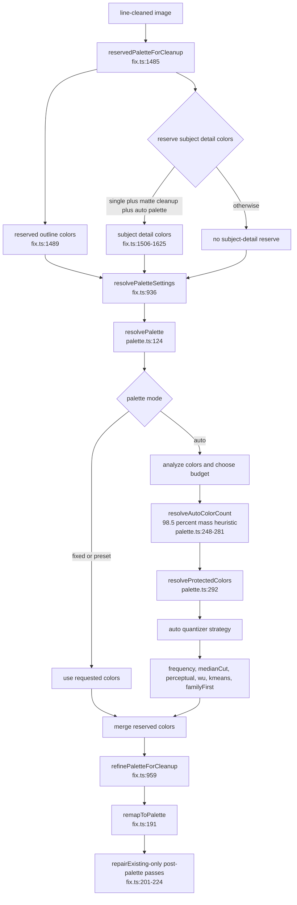

# Single-sprite and icon fix pipeline

The single-image branch is the most complete path through PixelAid's fixer. It runs when `fixImage()` does not dispatch to `fixSheetFrames()` (`packages/core/src/fix.ts:34 fixImage()`, `fix.ts:280 isSheetFrameFix()`). For normal sprites and icons that means `options.mode === "single"`; the same non-frame code is also used when a non-single mode is supplied without `sheetFrames`.

The important composition detail is that PixelAid does not simply downsample and quantize. It can pre-remove a connected background, resolve a target-guided pixel grid, optionally plan local grid drift, expand contrast, detect mixels on the original image while applying regularization to the processed image, downsample, clean alpha and edges, reserve key colors, resolve a palette, and remap the final image.

## Reconstruction strategy and output packaging

The web and desktop editors default eligible single sprites and icons to Robust Preview with Guarded safety; backgrounds are eligible only when the full native canvas is reconstructed instead of cropping to subject bounds. Classic remains selectable and is still the omitted compatibility default for low-level and automation callers. Robust changes automatic native-grid inference and reconstruction sampling only. It does not alter classification, background removal, alpha, outline, palette, downscale method, or cleanup choices.

Guarded safety compares the Robust proposal with Classic and can return the Classic reconstruction with structured reason codes. Warn retains the Robust proposal with the same warning evidence; Raw exposes the frozen proposal for diagnosis. Manual grid or native-size values bypass automatic strategy selection.

After native reconstruction, output packaging applies independent canvas bounds, framing, pixel scale, and anchor. An exact 128x128 canvas therefore remains 128x128 whether Guarded uses Robust or falls back to Classic. See [Robust Preview](../robust-preview.md) for the product-facing contract.

## Main flow

```mermaid
flowchart TD
  A["fixImage input<br/>fix.ts:34"] --> B{"sheet-frame fix"}
  B -->|"yes"| Z["see sprite-sheet.md"]
  B -->|"no"| C{"alpha is backgroundFloodFill"}
  C -->|"yes"| D["background pre-alpha<br/>applyAlphaMode<br/>fix.ts:41-45"]
  C -->|"no"| E["use original source"]
  D --> F["processingSource"]
  E --> F
  F --> G["resolveGrid<br/>fix.ts:48 and 1677"]
  G --> H{"single and localCorrection"}
  H -->|"yes"| I["planLocalGridDrift<br/>fix.ts:49-60"]
  H -->|"no"| J["grid unchanged"]
  I --> K["gridWithDrift"]
  J --> K
  K --> L["contrast expansion<br/>fix.ts:61-63"]
  L --> M{"single and fixMixels"}
  M -->|"yes"| N["detectMixels on original<br/>regularize processed image<br/>fix.ts:67-85"]
  M -->|"no"| O["contrast-expanded image"]
  N --> P["downsample source"]
  O --> P
  P --> Q{"single and snap"}
  Q -->|"yes"| R["snapToGrid uniform scale<br/>fix.ts:90-103"]
  Q -->|"no"| S["downsampleBlocks<br/>fix.ts:105-127"]
  R --> T["downsampled image"]
  S --> T
  T --> U["post-downsample alpha cleanup<br/>fix.ts:131-139"]
  U --> V["optional outline padding<br/>fix.ts:140-141"]
  V --> W["halo removal"]
  W --> X["denoise"]
  X --> Y["morphology and deferred RGB decontamination"]
  Y --> AA["outline cleanup"]
  AA --> AB{"lineCleanup set"}
  AB -->|"yes"| AC["applyLineCleanup"]
  AB -->|"no"| AD["skip line cleanup"]
  AC --> AE["palette stage"]
  AD --> AE
  AE --> AF["remapToPalette"]
  AF --> AG{"repairExisting<br/>resolved color"}
  AG -->|"semantic colors"| AH["source-coordinate semantic fringe<br/>fix.ts:206-214"]
  AG -->|"no semantic colors"| AI["neutral-gray shell normalization<br/>fix.ts:215-224"]
  AG -->|"no"| AJ["PixelFixResult diagnostics"]
  AH --> AI
  AI --> AJ
```

## Stage-by-stage walkthrough

| Order | Stage | Code anchors | What happens |
| --- | --- | --- | --- |
| 1 | Dispatch | `fix.ts:34 fixImage()`, `fix.ts:280 isSheetFrameFix()` | If `options.mode !== "single"` and `sheetFrames.length > 0`, `fixImage()` exits to the sheet-frame path. Otherwise this path continues. |
| 2 | Optional pre-alpha | `fix.ts:41-45`, `alpha.ts:10 applyAlphaMode()` | Only `options.alpha === "backgroundFloodFill"` runs before grid detection. `alpha.ts:97 backgroundFloodFill()` is border-seeded connected fill against `estimateBackgroundModel()`, not global color-keying; it then peels exterior chroma matte and binarizes alpha (`alpha.ts:143-156`). |
| 3 | Grid resolution | `fix.ts:48`, `fix.ts:1677 resolveGrid()` | Auto mode uses runtime-supplied candidates or the selected Classic/Robust `detectGridCandidates()` path (`fix.ts:1678-1680`). Eligible Robust requests then apply the selected safety policy and preserve structured selection diagnostics. If target size is known, it guides candidate selection and scale; manual mode derives scale and output dimensions directly. |
| 4 | Local drift planning | `fix.ts:49-60`, `gridDrift.ts: planLocalGridDrift()` | Runs only for `options.mode === "single" && options.grid.localCorrection`. Used drift boundaries feed `downsampleBlocks()` as row/column boundary arrays. |
| 5 | Contrast expansion | `fix.ts:61-63`, `contrastExpansion.ts: applyContrastExpansion()` | Runs before mixel regularization and downsampling. Disabled settings still produce diagnostics with `enabled: false`. |
| 6 | Mixel regularization | `fix.ts:64-87`, `mixels.ts: detectMixels()`, `mixels.ts: regularizeMixels()` | If `options.grid.fixMixels` is true in single mode, PixelAid detects mixels on the **original** image but applies regularization to the contrast-expanded/preprocessed image. The comments at `fix.ts:70-72` explain why: background flood-fill and preprocessing add alpha-edge noise and flat transparent regions that would skew the flatness and roughness signal. |
| 7 | Downsample or snap | `fix.ts:88-127`, `snap.ts: snapToGrid()`, `downsample.ts:94 downsampleBlocks()` | `grid.snap` forces one uniform integer scale from the resolved grid (`fix.ts:91-103`). Otherwise `downsampleBlocks()` uses grid scale, phase, optional drift boundaries, downscale method, alpha mode, and adaptive coverage (`fix.ts:105-127`). |
| 8 | Post-downsample alpha cleanup | `fix.ts:129-139`, `fix.ts:1114 getPostDownsampleAlphaMode()` | A source pre-cleaned by background flood fill gets a second pass as `binary` alpha (`fix.ts:1114-1116`), with threshold defaulting to 128 (`fix.ts:1118-1127`). Other modes stay as requested. |
| 9 | Outline padding | `fix.ts:140-141`, `fix.ts:1398 getAutoCroppedOutlinePadding()`, `fix.ts:1413 padImageForOutline()` | If auto grid cropping was used for a single image and outline cleanup is enabled, PixelAid pads output by outline size, capped 1-8 px. Background fill for padding is transparent for `backgroundFloodFill`; otherwise it estimates corner color. |
| 10 | Halo removal | `fix.ts:142`, `halo.ts: applyHaloRemovalDetailed()` | Runs every time but is enabled only when `cleanup.removeHalos` is true. Diagnostics are included only when the option is enabled (`fix.ts:212`). |
| 11 | Denoise | `fix.ts:144`, `denoise.ts: applyDenoise()` | Uses `cleanup.denoiseStrength ?? 0`. |
| 12 | Morphology and deferred transparent RGB cleanup | `fix.ts:145-146`, `fix.ts:1130 decontaminateTransparentRgbAfterMatteCleanup()`, `fix.ts:1142 shouldDeferTransparentRgbDecontamination()` | Morphology can clean alpha and matte artifacts. When alpha is not preserve, matte cleanup is enabled, and decontamination is requested, PixelAid defers transparent-RGB decontamination until after morphology so matte cleanup can still see chroma artifacts. |
| 13 | Outline cleanup | `fix.ts:147-157`, `outline.ts: applyOutlineCleanupDetailed()` | `outlineMode`, `outlineColor`, `outlineSourceColors`, `outlineAlpha`, `outlineSize`, `removeOrphans`, and `preserveSinglePixelDetails` are wired through. `closeGaps` comes from `lineCleanup !== "off"` when `lineCleanup` is set, otherwise from `jaggyCleanup` (`fix.ts:154`). Outline candidate detection assumes dark outlines; `outline.ts` defines `OUTLINE_CANDIDATE_LUMA = 168`. |
| 14 | Line cleanup | `fix.ts:159-163`, `lineCleanup.ts: applyLineCleanup()` | Runs only when `cleanup.lineCleanup` is defined, including non-`off` strengths. The phase name is recorded as `alpha-cleanup` in this code path (`fix.ts:161`). |
| 15 | Palette reserve, resolve, refine | `fix.ts:166-178`, `fix.ts:1485 reservedPaletteForCleanup()`, `palette.ts:124 resolvePalette()` | Builds reserved colors, resolves an auto/fixed/preset palette, then filters or merges colors for cleanup-sensitive cases. See palette diagram below. |
| 16 | Palette remap | `fix.ts:191-200`, `palette.ts: remapToPalette()` | Remaps visible pixels to the effective palette with selected dithering and color space. This is not always the final image for single-image `repairExisting`. |
| 17 | Source-coordinate semantic fringe replacement | `fix.ts:201-214`, `fix.ts:1019-1038`, `semanticFringeCleanup.ts:39-92`, `semanticFringeCleanup.ts:178-324` | Runs only for `options.mode === "single"`, `cleanup.outlineMode === "repairExisting"`, a resolved repair outline color, and non-empty `cleanup.semanticFringeColors`. It derives raw-source exterior semantic evidence from the whole source-image border while flood traversal is limited to `sourceRect`, maps final pixels through outline padding and `sourceRect`, recolors RGB to the resolved repair outline, and preserves alpha. If no repair color is resolved, it skips. |
| 18 | Neutral-gray shell normalization | `fix.ts:215-224`, `fix.ts:1041-1059`, `neutralGrayShellCleanup.ts:28-65`, `neutralGrayShellCleanup.ts:142-177`, `neutralGrayShellCleanup.ts:314-346` | Runs only for single-image `repairExisting` with a resolved repair outline color. It uses raw source plus pre-outline exterior evidence, narrow neutral-gray candidate selection, and padded coordinate mapping to recolor exterior shell RGB to the resolved outline while preserving alpha. |
| 19 | Result assembly | `fix.ts:230-265` | Adds image, palette, grid, metrics, settings, and diagnostics. Mixel and padding changes are reflected in the result grid (`fix.ts:232-233`). |

The post-palette order is always `remapToPalette()` -> repair-only source-coordinate semantic fringe replacement -> repair-only neutral-gray shell normalization -> result assembly. `none` and `add` do not run these repair-only passes, and sheet-frame fixes stay on their own packed-sheet remap/result path.

### Downsample method variants

`downsampleBlocks()` is one pipeline node but supports multiple samplers via `options.downscale` (`downsample.ts:118-145`):

- `dominant`
- `median`
- `adaptive`
- `averageThenPalette`
- `detailPreserving`
- `contrast`
- `kCentroid`
- `perceptual`
- `nearest`
- `bilinear`

Dominant-style RGB statistics ignore fully transparent pixels (`alpha < 16`) and maintain separate alpha totals (`downsample.ts:257-326`). Median, adaptive, perceptual, and foreground coverage logic similarly treat alpha as part of block selection; binary alpha is resolved after the color sample (`downsample.ts:147-155`, `downsample.ts:343-348`).

## Palette stage

Palette details:

- `reservedPaletteForCleanup()` is `reservedOutlinePalette + subjectDetailPaletteColors` (`fix.ts:1485-1486`). Subject detail reservation is gated to single mode, morphology matte cleanup, non-fixed palette, and no explicit `options.palette` (`fix.ts:1617-1625`).
- `resolvePalette()` normalizes settings, analyzes visible colors, selects the palette source according to lock scope, resolves `maxColors`, protects colors, extracts or accepts colors, checks drift, checks dithering safety, and returns diagnostics (`palette.ts:124-201`).
- Auto color count keeps enough ranked color mass to explain 98.5 percent, capped by the default auto cap of 64 (`palette.ts:248-281`).
- Protected colors are dominant near-black boundary outline color, high-saturation accents above a 1 percent floor, and optional salient accent clusters (`palette.ts:292-328`). Salient clusters use coarse hue sextants, saturation/value bands, a 0.1 percent area floor, and hue-family round-robin selection (`palette.ts:426-508`).
- Strategy variants are one stage: `frequency`, `medianCut`, `perceptual`, `wu`, `kmeans`, and `familyFirst` (`palette.ts:231-247`). `familyFirst` buckets visible colors into perceptual families, seats representative medoids first, then adds nested monotone ramp splits as the budget grows.
- `refinePaletteForCleanup()` filters matte palette colors for non-single matte-cleanup outputs and can merge nearby auto palette colors when non-single binary denoise is strong (`fix.ts:959-1005`).

## Guided defaults that drive this path

`suggestFixSettings()` classifies the asset, picks a mode, and sets defaults before the UI or automation converts the suggestion to `FixOptions` (`fixSuggestions.ts:108-349`, `packages/automation/src/operations.ts:939 automationOptionsFromCoreSuggestion()`). The main inputs are grid candidates, sheet layout confidence, tilemap diagnostics, transparent-grid evidence, foreground-object evidence, exact color count, and baked transparency hints (`fixSuggestions.ts:108-156`).

For single sprites and icons:

- Alpha may become `backgroundFloodFill` only for `sprite` or `icon` when corner alpha is opaque and the image has a bright or removable opaque background (`fixSuggestions.ts:1842-1882`).
- `fixMixels` is recommended only for single, non-background assets when `detectMixels()` reports roughness at least 0.65, a near-certain bar above the base detection threshold (`fixSuggestions.ts:355-374`).
- Matte cleanup turns on for visible chroma matte on single sprites/icons with `backgroundFloodFill` (`fixSuggestions.ts:193-197`, `fixSuggestions.ts:869-877`).
- Palette strategy becomes `familyFirst` for single sprites/icons when flood-fill alpha or matte cleanup is active; otherwise it is `medianCut` (`fixSuggestions.ts:484-500`). Because `familyFirst` seats vivid families natively, the subject-detail reservation and salient protected-color bolt-ons are skipped for it (`fix.ts:1617-1625`, `palette.ts:145-149`, `palette.ts:299-309 resolveFamilyFirstProtectedColors`).
- Denoise, halo removal, orphan removal, jaggy cleanup, and preservation of single-pixel details come from asset presets unless special low-scale or matte-cleanup branches override them (`assetTypePresets.ts:72-86`, `fixSuggestions.ts:796-888`).
- Outline defaults are enabled only when cleanup eligibility and outline evidence agree; selected source colors are dark candidate colors, typically one or two (`fixSuggestions.ts:679-698`).
- Semantic fringe colors live in `cleanup.semanticFringeColors`. Guided or explicit callers can serialize them in `FixOptions` and export manifests; there is no separate post-palette repair flag. In `repairExisting`, those colors enable the source-coordinate semantic fringe pass only when a repair outline color is also resolved.

## Diagnostics and metadata

`PixelFixResult.diagnostics` for this path is assembled at `fix.ts:210-220`:

| Diagnostic key | Source | Included when |
| --- | --- | --- |
| `alpha` | merged pre-alpha and post-alpha results | Always in this path after alpha cleanup |
| `halo` | `applyHaloRemovalDetailed()` | Only when `cleanup.removeHalos` is true |
| `contrastExpansion` | `applyContrastExpansion()` | Always included |
| `mixels` | `regularizeMixels()` | Only when mixel regularization ran |
| `morphology` | `applyMorphologyCleanup()` | Only when `cleanup.morphology.enabled` is true |
| `outline` | `applyOutlineCleanupDetailed()` | Only when `cleanup.outlineMode !== "none"` |
| `lineCleanup` | `applyLineCleanup()` | Only when `cleanup.lineCleanup` is defined |
| `palette` | `resolvePalette()` plus `refreshPaletteDiagnostics()` | Always after palette extraction |
| `phaseTimings` | runtime phase timer | Only when a phase timer is present |

Grid diagnostics are attached to `result.grid`, not `diagnostics`: local drift is added by `attachDriftDiagnostics()` (`fix.ts:227-245`) and mixel notes by `attachMixelDiagnostics()` (`fix.ts:247-278`).

## Where the knobs live

| `FixOptions` field | Pipeline effect |
| --- | --- |
| `mode`, `sheetFrames` | Dispatch to sheet-frame path when non-single and frames exist (`fix.ts:280-282`). |
| `targetWidth`, `targetHeight` | Target-guided grid selection and manual fallback output size (`fix.ts:1681-1730`). |
| `grid.detect` | Auto candidates versus manual grid settings (`fix.ts:1677-1736`). |
| `grid.scale`, `scaleX`, `scaleY`, `phaseX`, `phaseY` | Manual grid and target-guided scale/phase overrides (`fix.ts:1691-1703`, `fix.ts:1722-1736`). |
| `grid.cropToBounds` | Defaults true for single mode inside grid and outline padding logic (`fix.ts:1693`, `fix.ts:1400`). |
| `grid.localCorrection` | Enables `planLocalGridDrift()` for single mode (`fix.ts:49-60`). |
| `grid.fixMixels` | Enables detect-on-original and apply-on-processed mixel regularization in single mode (`fix.ts:67-85`). |
| `grid.snap` | Chooses `snapToGrid()` instead of `downsampleBlocks()` for single mode (`fix.ts:91-103`). |
| `downscale` | Selects block sampler method for downsample and mixel regularization (`fix.ts:77`, `fix.ts:115`). |
| `alpha`, `alphaSettings` | Selects pre-alpha, downsample alpha behavior, post-alpha mode, thresholds, color key, tolerance, and transparent RGB (`fix.ts:41-45`, `fix.ts:131-136`, `alpha.ts:10-35`). |
| `cleanup.contrastExpansion` | Controls contrast expansion before mixels and downsample (`fix.ts:61-63`). |
| `cleanup.removeHalos` | Enables halo removal diagnostics and edits (`fix.ts:142`, `fix.ts:212`). |
| `cleanup.denoiseStrength` | Controls denoise strength (`fix.ts:144`). |
| `cleanup.morphology` | Controls morphology and deferred transparent-RGB cleanup (`fix.ts:145-146`, `fix.ts:1142-1149`). |
| `cleanup.outlineMode`, `outlineColor`, `outlineSourceColors`, `outlineAlpha`, `outlineSize` | Control outline repair/add passes and optional auto padding (`fix.ts:140-157`). |
| `cleanup.semanticFringeColors` | Supplies the semantic color family for fringe cleanup and the single-image `repairExisting` source-coordinate post-palette replacement; the latter also requires a resolved repair outline color (`fix.ts:201-214`, `fix.ts:1019-1038`). |
| `cleanup.removeOrphans`, `jaggyCleanup`, `preserveSinglePixelDetails` | Feed outline cleanup and gap closing (`fix.ts:153-155`). |
| `cleanup.lineCleanup` | Controls outline gap closing and optional `applyLineCleanup()` pass (`fix.ts:154`, `fix.ts:159-163`). |
| `palette`, `paletteSettings`, `maxColors` | Fixed, preset, or auto palette resolution and remap (`fix.ts:168-188`, `palette.ts:124-201`). |
