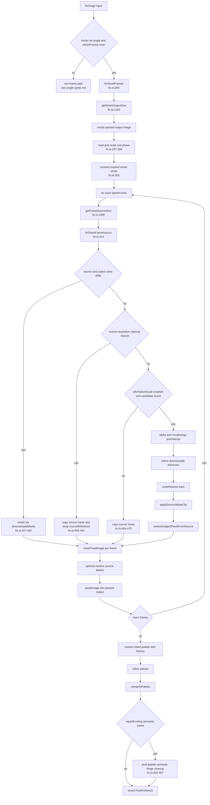

# Sprite-sheet fix pipeline

Sprite sheets use the frame-aware branch of `fixImage()` when `options.mode !== "single"` and `options.sheetFrames` contains at least one frame (`packages/core/src/fix.ts:280 isSheetFrameFix()`). The branch is implemented by `fixSheetFrames()` at `fix.ts:284`. Instead of resolving one crop grid and downsampling the whole source, PixelAid computes output packing, fixes each frame into its destination rectangle, then resolves one shared sheet palette.

The sheet path moves most cleanup inside a per-frame loop. It does not run the single-image grid-resolution or mixel branch. It uses the explicit frame plan supplied by the UI, CLI, automation, or suggestions, and it keeps palette locking, drift diagnostics, matte filtering, palette remap, and the existing repair-only post-palette semantic-fringe cleanup at sheet scope. It does not run the single-image source-coordinate semantic fringe replacement or neutral-gray shell normalization passes.

## Main flow

## Frame preparation and output size

| Stage | Code anchors | Composition details |
| --- | --- | --- |
| Dispatch | `fix.ts:34-39`, `fix.ts:280-282` | Only non-single modes with non-empty `sheetFrames` use this branch. `spriteSheet`, `animationSheet`, `characterSheet`, `iconSet`, `tileset`, and `tilemap` can all enter here if frames are supplied. |
| Output size | `fix.ts:292-295`, `fix.ts:1264 getSheetOutputSize()` | Starts from `targetWidth` and `targetHeight`, expands to fit `options.sheet` packed dimensions, then expands again to include every `frame.rect`. Result width and height are rounded and at least 1. |
| Grid scale and phase | `fix.ts:297-300` | Uses `options.grid.scaleX`, `scaleY`, or shared `scale`, plus phase. There is no call to `resolveGrid()` in this branch. |
| Whole-sheet contrast expansion | `fix.ts:303` | `applyContrastExpansion()` runs once on the full source before frame extraction. Per-frame source images are copied or downsampled from this contrast-expanded sheet. |

## Per-frame source selection

`getFrameSourceRect()` maps each destination frame to source pixels (`fix.ts:1289-1322`):

- If `frame.sourceRect` exists, it is rounded and used directly (`fix.ts:1297-1311`).
- Otherwise source rect is derived from `frame.rect`, grid scale, and phase: `x = phaseX + frame.rect.x * scaleX`, `y = phaseY + frame.rect.y * scaleY`, with width and height scaled similarly (`fix.ts:1298-1303`).
- Derived rects are clamped inside the image (`fix.ts:1314-1321`).

The frame loop also accumulates `sourceBounds` for the final result grid (`fix.ts:311-313`, `fix.ts:372-374`).

## `fixSheetFrameSource()` branches

| Branch | Code anchors | When it runs | What it returns |
| --- | --- | --- | --- |
| Resize path | `fix.ts:427-452` | Source rect size differs from output frame rect. | Calls `downsampleBlocks()` with source-to-output scale and destination size. `inferredNativeScale` is false. |
| Source-resolution cleanup path | `fix.ts:455-461`, `fix.ts:511-522` | Same-size source/output, `cleanup.inferNativeScale === true`, grid scale <= 1.25, morphology matte cleanup enabled. | Copies the source frame and stores `sourceReference` so source details can be restored after cleanup. |
| Simple copy path | `fix.ts:464-470` | Same-size source/output and no native-scale candidate. | Copies the source frame with no source reference. |
| Infer-native-scale path | `fix.ts:464-508`, `fix.ts:846 inferNativeScaleFrame()` | `cleanup.inferNativeScale` is true and `detectGridCandidates()` finds a plausible smaller native grid inside the frame. | Pre-cleans alpha and optional matte morphology, downscales to inferred native size using `dominant`, scales nearest-neighbor back to the output rect, clips matte color against source alpha, and restores source subject pixels. |

The infer-native-scale branch is cleanup-first rather than whole-sheet resize-first:

1. `inferNativeScaleFrame()` searches scales 2-12, requires confidence at least 0.25, and requires output dimensions smaller than source (`fix.ts:846-876`).
2. `applyAlphaMode()` runs on the frame source; if morphology matte cleanup is enabled, `applyMorphologyCleanup()` runs before native downsample (`fix.ts:472-478`).
3. Native downsample uses `method: "dominant"`; binary matte cleanup can set `binaryAlphaThreshold: 64` through `shouldUseCoveragePreservingNativeScale()` (`fix.ts:480-499`, `fix.ts:524-531`).
4. `scaleNearest()` returns to destination frame size (`fix.ts:502`, `fix.ts:878-893`).
5. `applySourceAlphaClip()` removes expanded matte pixels unsupported by source alpha (`fix.ts:503`, `fix.ts:533-560`).
6. `restoreSubjectPixelsFromSource()` protects source subject details using `buildSourceSubjectDetailMask()` (`fix.ts:506`, `fix.ts:602-635`, `fix.ts:730-825`).

## Per-frame cleanup

After frame source repair, every frame goes through `cleanFixedImage()` (`fix.ts:322`, `fix.ts:1151-1190`):

| Order | Cleanup stage | Code anchors | Notes |
| --- | --- | --- | --- |
| 1 | Alpha | `fix.ts:1157-1160`, `fix.ts:1103 getAlphaSettingsForPreCleanup()` | May defer transparent-RGB decontamination for matte cleanup. |
| 2 | Halo | `fix.ts:1161-1163`, `halo.ts: applyHaloRemoval()` | Enabled by `cleanup.removeHalos`. This per-frame helper returns only the image, not detailed halo diagnostics. |
| 3 | Denoise | `fix.ts:1164` | Uses `cleanup.denoiseStrength`; inferred-native frames cap denoise strength at 12 via `getSheetFrameCleanupOptions()` (`fix.ts:895-907`). |
| 4 | Morphology | `fix.ts:1166-1168` | Morphology diagnostics are merged across frames by `mergeMorphologyDiagnostics()` (`fix.ts:323-325`, `fix.ts:1232-1261`). |
| 5 | Deferred transparent RGB decontamination | `fix.ts:1168`, `fix.ts:1130-1149` | Same deferred matte-cleanup logic as the single path. |
| 6 | Outline | `fix.ts:1169-1179` | Uses `applyOutlineCleanup()` rather than the detailed variant. Options mirror the single path, including gap closing from `lineCleanup` or `jaggyCleanup`. |
| 7 | Line cleanup | `fix.ts:1180-1183` | Runs if `cleanup.lineCleanup` is defined. |
| 8 | Refresh alpha diagnostics | `fix.ts:1185-1189`, `fix.ts:1192-1210` | Recounts alpha after outline and line cleanup so merged alpha diagnostics match the final frame. |

If `fixSheetFrameSource()` supplied a `sourceReference`, the cleaned frame is passed through `restoreSubjectPixelsFromSource()` one more time before paste (`fix.ts:323`). Then `pasteImage()` writes the frame into the packed output at `frame.rect` (`fix.ts:326`, `fix.ts:1324-1332`).

## Shared sheet-level tail

Once all frames are packed, PixelAid resolves one palette for the whole sheet, remaps the packed image, and may run the existing repair-only post-palette semantic-fringe cleanup. The sheet tail does not run `repairSourceCoordinateSemanticFringeReplacement()` or `repairNeutralGrayShellNormalization()`:

| Stage | Code anchors | Composition details |
| --- | --- | --- |
| Palette reserve | `fix.ts:337`, `fix.ts:1485 reservedPaletteForCleanup()` | Same helper as single path. Subject-detail reservation is gated to `options.mode === "single"`, so sheet/tile modes only reserve outline colors. |
| Palette settings | `fix.ts:338`, `fix.ts:936 resolvePaletteSettings()` | If no explicit `paletteSettings`, `protectSalientColors` defaults false for sheets because `options.mode !== "single"` (`fix.ts:936-957`). |
| Palette resolve | `fix.ts:339-346`, `palette.ts:124 resolvePalette()` | Frames are passed to `resolvePalette()` so lock-scope source selection, dithering safety, and drift diagnostics can inspect per-frame rects (`fix.ts:344`). |
| Palette drift | `palette.ts:159-169`, `palette.ts:1512 analyzePaletteDrift()` | For each frame, PixelAid computes a frame-local auto palette and counts colors that are outside the active sheet palette. Diagnostics include stability score and warnings. |
| Palette refinement | `fix.ts:347-348`, `fix.ts:959 refinePaletteForCleanup()` | Non-single matte cleanup can filter magenta matte palette artifacts (`fix.ts:968-988`). Non-single binary outputs with high denoise can merge nearby auto palette colors (`fix.ts:998-1005`). |
| Remap | `fix.ts:392-400`, `palette.ts: remapToPalette()` | Applies the effective sheet palette to the packed image with the resolved dithering and color space. |
| Post-palette semantic fringe cleanup | `fix.ts:402-407`, `fix.ts:1000-1016` | Runs only when `outlineMode` is `repairExisting`, `cleanup.semanticFringeColors` is non-empty, and a repair outline color is resolved. This is the existing sheet-safe semantic cleanup, not the single-image source-coordinate or neutral-gray shell repairs. |
| Result assembly | `fix.ts:424-451` | Returns packed image, palette, synthetic frame-aware grid, metrics, settings, and diagnostics. |

## Sheet conditioning and frame proposals

Guided suggestions use sheet analysis before the fix runs; this is not a separate pass inside `fixSheetFrames()`.

- `suggestFixSettings()` calls `detectSheetLayout()` when the source looks sheet-like, and gets conditioning either from layout diagnostics or `analyzeSheetConditioning()` (`fixSuggestions.ts:120-127`).
- `analyzeSheetConditioning()` checks exact RGBA color count, coarse foreground bins, soft alpha, chroma matte pixels, opaque dark backgrounds, checkerboard cells, captions/brackets, and presentation-sheet artifacts (`sheetConditioning.ts:17-178`). Its `recommendFrameFirst` flag drives suggestion defaults.
- Strict source-sheet cleanup is enabled only for cell-grid modes, source-sized layouts, and conditioning issues like soft alpha noise, chroma matte artifacts, excessive exact colors, dense coarse palette, or presentation artifacts (`fixSuggestions.ts:506-563`).
- Sheet slicing and detected frame proposals live in `packages/core/src/sheet.ts`: `sliceSheetFrames()` creates a regular row/column frame list from `SheetSliceOptions` (`sheet.ts:107-128`), while `detectSheetLayout()` detects rows, segments, labels, source rects, and animations (`sheet.ts:130-260`).
- The web app passes `sheet` and `sheetFrames` only when sheet mode is active (`apps/web/src/App.tsx:4260-4307`). The CLI `fixSpriteSheet()` detects layout or accepts frames, then merges them into the suggestion before calling `fixImage()` (`packages/automation/src/operations.ts:514-537`).

## Diagnostics and metadata

`fixSheetFrames()` assembles diagnostics at `fix.ts:440-447`:

| Diagnostic key | Source | Included when |
| --- | --- | --- |
| `alpha` | merged per-frame alpha diagnostics | At least one frame produced alpha diagnostics, normally yes |
| `contrastExpansion` | whole-sheet `applyContrastExpansion()` | Always included |
| `morphology` | merged per-frame morphology diagnostics | Only if at least one frame had morphology diagnostics |
| `semanticFringe` | merged per-frame and optional post-palette semantic cleanup diagnostics | Only if `cleanup.semanticFringeColors` caused a semantic cleanup pass |
| `palette` | sheet-level `resolvePalette()` and refinement | Always included |
| `phaseTimings` | runtime phase timer | Only with a phase timer |

The sheet path does **not** include `halo`, `outline`, or `lineCleanup` diagnostics in the result even if those edits occurred inside `cleanFixedImage()`, because the helper does not return those detailed diagnostic records (`fix.ts:1294-1340`). The result grid is synthetic: output size is the final sheet size, scale and phase come from options, confidence is 1, and `sourceRect` is the union of all frame source rects (`fix.ts:411-423`).

## Where the knobs live

| `FixOptions` field | Pipeline effect |
| --- | --- |
| `mode`, `sheetFrames` | Required for dispatch into `fixSheetFrames()` (`fix.ts:280-282`). |
| `targetWidth`, `targetHeight`, `sheet`, `sheetFrames` | Determine packed output size (`fix.ts:1264-1286`). |
| `grid.scale`, `scaleX`, `scaleY`, `phaseX`, `phaseY` | Map destination frames to source rects when `frame.sourceRect` is absent (`fix.ts:297-311`, `fix.ts:1289-1322`). |
| `downscale` | Used by resize-path `downsampleBlocks()` for source/output size mismatches (`fix.ts:427-452`). |
| `alpha`, `alphaSettings` | Used in per-frame alpha cleanup and native-scale precleanup (`fix.ts:472-478`, `fix.ts:1157-1160`). |
| `cleanup.inferNativeScale` | Enables strict source-resolution branch and infer-native-scale branch (`fix.ts:511-522`, `fix.ts:464-508`). |
| `cleanup.morphology` | Enables matte precleanup in native-scale branch and per-frame morphology (`fix.ts:472-478`, `fix.ts:1166-1168`). |
| `cleanup.removeHalos` | Enables per-frame halo removal (`fix.ts:1161-1163`). |
| `cleanup.denoiseStrength` | Controls per-frame denoise; capped for inferred-native cleanup (`fix.ts:895-907`). |
| `cleanup.outlineMode`, `outlineColor`, `outlineSourceColors`, `outlineAlpha`, `outlineSize`, `semanticFringeColors` | Control per-frame outline cleanup and the existing sheet-safe semantic fringe cleanup; they do not enable the single-image source-coordinate or neutral-gray shell repairs (`fix.ts:402-407`, `fix.ts:1312-1328`). |
| `cleanup.jaggyCleanup`, `lineCleanup`, `preserveSinglePixelDetails`, `removeOrphans` | Feed per-frame outline and line cleanup (`fix.ts:1324-1331`). |
| `palette`, `paletteSettings`, `maxColors` | Control one sheet-level palette, remap, and sheet-safe post-palette semantic cleanup (`fix.ts:380-407`). |
