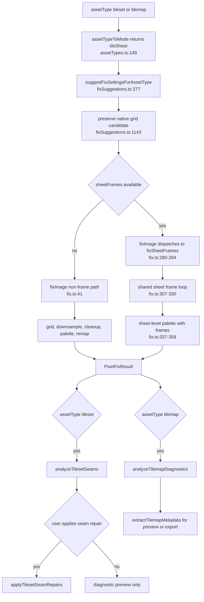
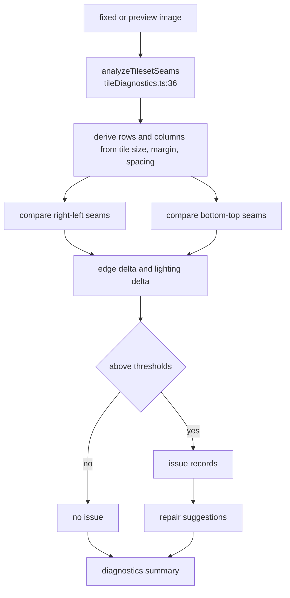
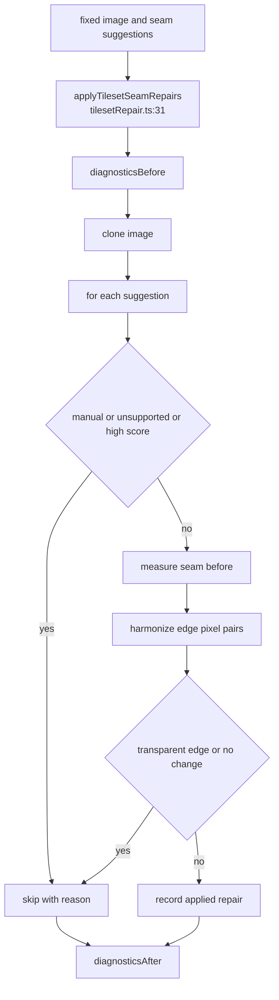
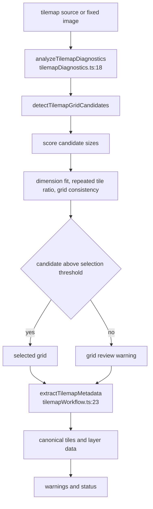

# Tileset and tilemap pipeline

`tileset` and `tilemap` are mapped to `tileSheet` mode by `packages/shared/src/assetTypes.ts:51-70` and `assetTypeToMode()` at `assetTypes.ts:149`. In the fixer itself, there is no separate tileset renderer: when `tileSheet` options include `sheetFrames`, the same frame-aware `fixSheetFrames()` path used by sprite sheets runs. Without `sheetFrames`, `fixImage()` falls through to the non-frame path because `isSheetFrameFix()` only checks for non-single mode plus non-empty frames (`packages/core/src/fix.ts:280-282`).

The tileset-specific behavior today is mostly defaults and side workflows around that shared fixer: native-grid preservation in suggestions, tile seam diagnostics, optional seam repair after fixing, tilemap grid diagnostics, and tilemap metadata extraction/export. This page documents those compositions plainly rather than inventing a hidden tileset-only fix algorithm.

## Main flow

## Routing and defaults

| Stage | Code anchors | What actually happens |
| --- | --- | --- |
| Asset type mapping | `assetTypes.ts:51-70`, `assetTypes.ts:149 assetTypeToMode()` | Both `tileset` and `tilemap` have `processingMode: "tileSheet"`. |
| Presets | `assetTypePresets.ts:104-133` | `tileset`: `maxColors: 16`, `downscale: "dominant"`, `alpha: "preserve"`, no orphan/jaggy cleanup, no halos, denoise 10, palette lock across frames. `tilemap`: `maxColors: 32`, `downscale: "dominant"`, `alpha: "preserve"`, no orphan/jaggy cleanup, no halos, denoise 0. |
| Guided native preservation | `fixSuggestions.ts:158-163`, `fixSuggestions.ts:1143 shouldPreserveNativeGridAsset()` | Auto classification or manual override for `tileset`/`tilemap` creates a source-preservation grid candidate: output size equals source size, scale 1, confidence 0.98. |
| Cell-grid mode handling | `fixSuggestions.ts:377-472`, `fixSuggestions.ts:502 isCellGridMode()` | Manual asset-type suggestions for `tileSheet` modes can run `detectSheetLayout()` and `analyzeSheetConditioning()` to produce `sheetLayout` and frames. |
| Strict source cleanup | `fixSuggestions.ts:506-563` | If a source-sized cell grid has conditioning issues, suggestions can enable cleanup-first native-scale behavior. This is the same mechanism used by sprite sheets. |
| Fix dispatch | `fix.ts:280-284` | `tileSheet` by itself is not enough. The frame-aware branch runs only when `sheetFrames` exists and is non-empty. |

## How `tileSheet` composes with `fixImage()`

When a tileset/tilemap has frames, the code path is exactly the sheet-frame path documented in `sprite-sheet.md`:

1. `fixSheetFrames()` computes the packed output size (`fix.ts:292-295`, `fix.ts:1264-1286`).
2. Each frame source rect is derived from `frame.sourceRect` or grid scale/phase (`fix.ts:311`, `fix.ts:1289-1322`).
3. `fixSheetFrameSource()` either downsample-resizes, copies source-resolution frames, or performs infer-native-scale cleanup (`fix.ts:414-508`).
4. `cleanFixedImage()` applies per-frame alpha, halo, denoise, morphology, outline, and line cleanup (`fix.ts:1151-1190`).
5. A shared palette is resolved across the packed sheet with frames passed to `resolvePalette()` for lock-scope and drift diagnostics (`fix.ts:337-358`, `palette.ts:159-169`).

When a tileset/tilemap lacks `sheetFrames`, it follows the non-frame branch. Because `mode !== "single"`, single-only pieces such as local drift planning, mixel regularization, and snap are skipped by their guards (`fix.ts:49-51`, `fix.ts:69`, `fix.ts:91`). It still resolves a grid, downsample/cleans, resolves a palette, remaps, and returns a result (`fix.ts:41-224`).

## Tileset seam diagnostics

`analyzeTilesetSeams()` is a diagnostic side workflow, not part of `fixImage()` (`packages/core/src/tileDiagnostics.ts:36`). It is exported from core (`packages/core/src/index.ts:108`) and used after or around fixes by the web app and automation.

Details:

- It derives `columns` and `rows` from image size, tile width/height, margin, and spacing (`tileDiagnostics.ts:39-45`).
- It compares adjacent right-left seams and bottom-top seams (`tileDiagnostics.ts:53-72`).
- Edge deltas use normalized RGB distance when both sides are visible, or alpha mismatch when one edge is transparent (`tileDiagnostics.ts:142-194`).
- Issues are created for `edge-mismatch` and `lighting-discontinuity` above thresholds (`tileDiagnostics.ts:197-235`).
- Repair suggestions are preview-only and choose `lightingHarmonization`, `manualRepaint`, or `edgeColorHarmonization` based on issue type and score (`tileDiagnostics.ts:238-260`).

## Tileset seam repair

`applyTilesetSeamRepairs()` is an explicit repair action, not an automatic fix stage (`packages/core/src/tilesetRepair.ts:31`). The web app exposes it after a fix and stores the result in `fixResult.diagnostics.tilesetRepairs` (`apps/web/src/App.tsx:4534-4571`).

The repair pass is conservative:

- Default supported auto strategies are `edgeColorHarmonization` and `lightingHarmonization` (`tilesetRepair.ts:26-31`).
- Suggestions are skipped for `manualRepaint`, unsupported strategies, `cropPhaseReview`, or confidence at/above `maxAutoRepairScore` 0.6 (`tilesetRepair.ts:44-58`).
- Repairs average the two edge pixels' RGBA values on each seam pair (`tilesetRepair.ts:129-167`). If either edge pixel is transparent, the repair is skipped as `transparent-edge` (`tilesetRepair.ts:141-143`).
- Diagnostics are recomputed before and after repair (`tilesetRepair.ts:36`, `tilesetRepair.ts:82-88`).

## Tilemap diagnostics and extraction

Tilemap diagnostics identify likely grid sizes; tilemap extraction turns a confirmed grid into metadata. Neither changes the fixed image.

`analyzeTilemapDiagnostics()` (`tilemapDiagnostics.ts:18-37`):

- Scores square candidate sizes by default `[8, 12, 16, 24, 32, 48, 64]` (`tilemapDiagnostics.ts:11-16`, `tilemapDiagnostics.ts:39-56`).
- Counts unique sampled tile signatures (`tilemapDiagnostics.ts:91-125`).
- Computes confidence from dimension fit, repeated-tile ratio, and grid consistency (`tilemapDiagnostics.ts:58-88`).
- Selects a candidate only when confidence, repeated ratio, rows, and columns clear thresholds (`tilemapDiagnostics.ts:22-29`).
- Adds grid-review and low-repeat/remainder warnings (`tilemapDiagnostics.ts:143-172`).

`extractTilemapMetadata()` (`tilemapWorkflow.ts:23-103`):

- Accepts confirmed `tileWidth`, `tileHeight`, offsets, spacing, optional rows/columns, identity threshold, and minimum repeat ratio.
- Walks the grid row-major, comparing each tile to canonical tiles by average RGBA distance (`tilemapWorkflow.ts:37-45`, `tilemapWorkflow.ts:105-139`, `tilemapWorkflow.ts:151-169`).
- Emits canonical tile records with ID, rect, first occurrence, occurrence count, coarse signature, and average color (`tilemapWorkflow.ts:70-101`).
- Emits a single layer named `Tilemap` with tile IDs (`tilemapWorkflow.ts:93-99`).
- Returns `ready` or `inspectOnly` based on warnings such as empty grid and low repeat confidence (`tilemapWorkflow.ts:52-68`).

## Web, CLI, and automation usage

| Surface | Tileset/tilemap usage | Code anchors |
| --- | --- | --- |
| Web preview | Computes `analyzeTilesetSeams()` for `assetType === "tileset"` when sheet mode and a preview image exist. Computes `extractTilemapMetadata()` for `assetType === "tilemap"`. | `apps/web/src/App.tsx:2542-2580` |
| Web seam repair | Calls `applyTilesetSeamRepairs()` as a user-triggered action and stores applied/skipped records in result diagnostics. | `apps/web/src/App.tsx:4534-4571` |
| Web export | For tilemaps, creates a generic tilemap export from `extractTilemapMetadata()` using export sheet dimensions and identity threshold. | `apps/web/src/App.tsx:6722-6737` |
| Automation inspect | Adds scene diagnostics for tilemaps, tilemap diagnostics for tilemaps, and tileset seam diagnostics for tilesets. | `packages/automation/src/operations.ts:236-251` |
| CLI | CLI commands call automation operations. `fixSpriteSheet()` is the path that supplies detected or explicit frames before `fixImage()`. | `packages/cli/src/index.ts:219-252`, `packages/automation/src/operations.ts:487-537` |

## Diagnostics and metadata

`fixImage()` itself returns the same diagnostics as the single or sheet path it actually used. Tileset-specific diagnostics are side products:

| Diagnostic or metadata | Produced by | Where it appears |
| --- | --- | --- |
| `palette.drift` | `resolvePalette()` when frames are supplied | `PixelFixResult.diagnostics.palette.drift` from the sheet path (`palette.ts:1512-1608`) |
| Matte palette filtering | `refinePaletteForCleanup()` | Reflected in final `palette` and palette diagnostics after refresh (`fix.ts:347-348`, `fix.ts:959-988`) |
| Tileset seam diagnostics | `analyzeTilesetSeams()` | Web preview/automation inspection; not automatically embedded by `fixImage()` |
| Tileset repair diagnostics | `applyTilesetSeamRepairs()` | Web app adds `diagnostics.tilesetRepairs` after repair (`apps/web/src/App.tsx:4561-4570`) |
| Tilemap diagnostics | `analyzeTilemapDiagnostics()` | Automation inspection and suggestion classification (`operations.ts:244-246`, `fixSuggestions.ts:128-131`) |
| Tilemap export metadata | `extractTilemapMetadata()` | Web preview and export bundle (`apps/web/src/App.tsx:2554-2567`, `apps/web/src/App.tsx:6722-6737`) |

## Where the knobs live

| Option or UI field | Pipeline effect |
| --- | --- |
| `assetType: "tileset"` or `"tilemap"` | Maps to `mode: "tileSheet"` through `assetTypeToMode()` (`assetTypes.ts:149`). |
| `sheet.frameWidth`, `frameHeight`, `rows`, `columns`, `margin`, `spacing` | Define frame slicing, packed output size, seam diagnostics, and tilemap extraction grid (`fix.ts:1264-1286`, `tileDiagnostics.ts:39-45`, `tilemapWorkflow.ts:23-32`). |
| `sheetFrames` | Required for frame-aware `fixSheetFrames()` dispatch (`fix.ts:280-284`). |
| `grid.scaleX`, `scaleY`, `phaseX`, `phaseY` | Map frame rects to source rects when no explicit `frame.sourceRect` exists (`fix.ts:1289-1322`). |
| `downscale` | Tileset/tilemap presets use `dominant` (`assetTypePresets.ts:104-133`); resize-path frames pass it to `downsampleBlocks()` (`fix.ts:427-452`). |
| `alpha`, `alphaSettings` | Defaults preserve alpha for tiles/tilemaps; frame cleanup still honors explicit alpha options (`assetTypePresets.ts:104-133`, `fix.ts:1157-1160`). |
| `cleanup.removeOrphans`, `jaggyCleanup`, `removeHalos`, `denoiseStrength` | Tileset/tilemap presets are conservative to avoid changing tile semantics (`assetTypePresets.ts:104-133`). |
| `cleanup.inferNativeScale`, `cleanup.morphology` | Enabled by strict source-sheet cleanup suggestions when source-sized cell grids have conditioning issues (`fixSuggestions.ts:506-563`, `fix.ts:511-522`). |
| `paletteSettings.lockScope`, `maxColors`, `palette`, `paletteSettings` | Control shared sheet palette and drift diagnostics (`fix.ts:337-358`, `palette.ts:124-201`). |
| Seam repair options | `tileWidth`, `tileHeight`, `margin`, `spacing`, `suggestions`, `enabledStrategies`, `maxAutoRepairScore` control `applyTilesetSeamRepairs()` (`tilesetRepair.ts:12-16`). |
| Tilemap extraction options | `tileWidth`, `tileHeight`, `offsetX`, `offsetY`, `spacing`, `rows`, `columns`, `identityThreshold` control metadata extraction (`tilemapWorkflow.ts:3-13`). |
